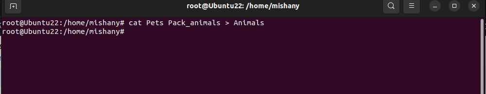
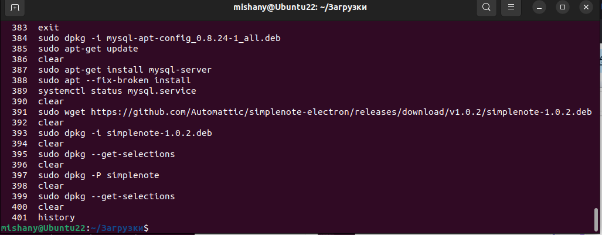
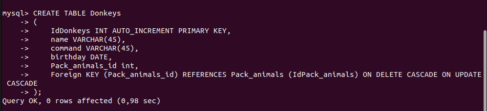

# Final_control_work

## Итоговая контрольная работа

### Информация о проекте

Необходимо организовать систему учета для питомника в котором живут домашние и вьючные животные.

### Как сдавать проект

Для сдачи проекта необходимо создать отдельный общедоступный репозиторий(Github, gitlub, или Bitbucket). Разработку вести в этом репозитории, использовать пул реквесты на изменения. Программа должна
запускаться и работать, ошибок при выполнении программы быть не должно. 
Программа, может использоваться в различных системах, поэтому необходимо разработать класс в виде конструктора

### Задание

Используя команду cat в терминале операционной системы Linux, создать два файла Домашние животные (заполнив файл собаками, кошками, хомяками) и Вьючные животными заполнив файл Лошадьми, верблюдами и ослы), а затем объединить их. Просмотреть содержимое созданного файла.
Переименовать файл, дав ему новое имя (Друзья человека).

Создаём файл “Домашние животные”, используя следующий синтаксис:
cat > Pets

Далее мы заполняем данный файл, добавляя в него следующие сведения, используя следующий синтаксис:  
dogs
cats
hamsters

После завершения заполнения сведениями данного файла выходим, используя следующее сочетание клавиш: 
ctrl + c

Создаём файл “Вьючные животные”, используя следующий синтаксис:
cat > Pack_animals

Далее мы заполняем данный файл, добавляя в него следующие сведения, используя следующий синтаксис: 
horses
camels
donkeys

После завершения заполнения сведениями данного файла выходим, используя следующее сочетание клавиш: 
ctrl + c

Теперь объединим эти два файла Pets и Pack_animals, используя следующий синтаксис: 
cat Pets Pack_animals > Animals 

Просмотрим содержимое созданного файла, используя следующий синтаксис:
 cat Animals

Переименуем созданный файл Animals, дав ему новое имя Mans_friends, используя следующий синтаксис: 
mv Animals Mans_friends

Убедимся в том, что наш файл переименовался, используя следующий синтаксис: 
ll

Создать директорию, переместить файл туда.

Создадим директорию FolderWithAnimals, используя следующий синтаксис:
mkdir FolderWithAnimals

Переместим файл Mans_friends в папку FolderWithAnimals, используя следующий синтаксис:
mv Mans_friends FolderWithAnimals

Подключить дополнительный репозиторий MySQL. Установить любой пакет из этого репозитория.

Скачиваем MSQL конфигуратор, используя следующий синтаксис:
sudo wget https://dev.mysql.com/get/mysql-apt-config_0.8.24-1_all.deb

Переходим в директорию Загрузки, в которую скачался пакет mysql-apt-config_0.8.24-1_all.deb, и устанавливаем данный, используя следующий синтаксис:
sudo dpkg -i mysql-apt-config_0.8.24-1_all.deb

После установки обновляем индекс пакетов, используя следующий синтаксис:
sudo apt-get update

Затем выполним установку пакета mysql-server, используя следующий синтаксис: 
sudo apt-get install mysql-server

Независимо от способа установки MySQL должна запускаться автоматически. Чтобы проверить это, проверьте ее статус, используя следующий синтаксис: 
systemctl status mysql.service

Установить и удалить deb-пакет с помощью dpkg.

Скачиваем
sudo wget https://github.com/Automattic/simplenote-electron/releases/download/v1.0.2/simplenote-1.0.2.deb

Устанавливаем
sudo dpkg -i simplenote-1.0.2.deb

Список установленных пакетов
sudo dpkg --get-selections

Если хотим удалить одновременно и пакет, и его конфигурационные файлы используйте:
sudo dpkg -P

Выложить историю команд в терминале ubuntu

Для того, чтобы просмотреть историю команд в терминале Ubuntu, необходимо использовать следующий синтаксис:
history

   51  clear
   52  cat > Pets
   53  clear
   54  cat > Pack_animals
   55  clear
   56  cat Pets Pack_animals > Animals
   57  clear
   58  cat Animals
   59  clear
   60  mv Animals Mans_friends
   61  clear
   62  ll
   63  clear
   64  mkdir FolderWithAnimals
   65  clear
   66  mv Mans_friends FolderWithAnimals
   67  clear
   68  cd FolderWithAnimals/
   69  ll
   70  clear
   71  sudo wget https://dev.mysql.com/get/mysql-apt-config_0.8.24-1_all.deb
   72  clear
   73  history
  383  exit
  384  sudo dpkg -i mysql-apt-config_0.8.24-1_all.deb
  385  sudo apt-get update
  386  clear
  387  sudo apt-get install mysql-server
  388  sudo apt --fix-broken install
  389  systemctl status mysql.service
  390  clear
391  sudo wget https://github.com/Automattic/simplenote-electron/releases/download/v1.0.2/simplenote-1.0.2.deb
  392  clear
  393  sudo dpkg -i simplenote-1.0.2.deb
  394  clear
  395  sudo dpkg --get-selections
  396  clear
  397  sudo dpkg -P simplenote
  398  clear
  399  sudo dpkg --get-selections
  400  clear
  401  history

Нарисовать диаграмму, в которой есть класс родительский класс, домашние животные и вьючные животные, в составы которых в случае домашних животных войдут классы: собаки, кошки, хомяки, а в класс вьючные животные войдут: Лошади, верблюды и ослы).

В подключенном MySQL репозитории создать базу данных “Друзья человека”

Заходим в MYSQL, используя следующий синтаксис: mysql

Создаём базу данных “Друзья человека”, используя следующий синтаксис: CREATE DATABASE Mans_friends; 

Проверяем, создалась ли наша база данных с именем Mans_friends, используя следующий синтаксис: show databases;

Создать таблицы с иерархией из диаграммы в БД

Заполнить низкоуровневые таблицы именами(животных), командами которые они выполняют и датами рождения

Удалив из таблицы верблюдов, т.к. верблюдов решили перевезти в другой питомник на зимовку. Объединить таблицы лошади, и ослы в одну таблицу.

Создать новую таблицу “молодые животные” в которую попадают все животные старше 1 года, но младше 3 лет и в отдельном столбце с точностью до месяца подсчитать возраст животных в новой таблице

Объединить все таблицы в одну, при этом сохраняя поля, указывающие на прошлую принадлежность к старым таблицам.

Создать класс с Инкапсуляцией методов и наследованием по диаграмме. [Инкапсуляцией методов](src/programs/encapsulation_of_methods)

Написать программу, имитирующую работу реестра домашних животных.
В программе должен быть реализован следующий функционал:
14.1 Завести новое животное
14.2 определять животное в правильный класс
14.3 увидеть список команд, которое выполняет животное
14.4 обучить животное новым командам
14.5 Реализовать навигацию по меню

Создайте класс Счетчик, у которого есть метод add(), увеличивающий̆ значение внутренней̆ int переменной̆ на 1 при нажатие “Завести новое животное” Сделайте так, чтобы с объектом такого типа можно было работать в блоке try-with-resources. Нужно бросить исключение, если работа с объектом типа счетчик была не в ресурсном try и/или ресурс остался открыт. Значение считать в ресурсе try, если при заведения животного заполнены все поля.

[задания с 13 - 15 в папке programs](src/programs "текст_подсказки")

